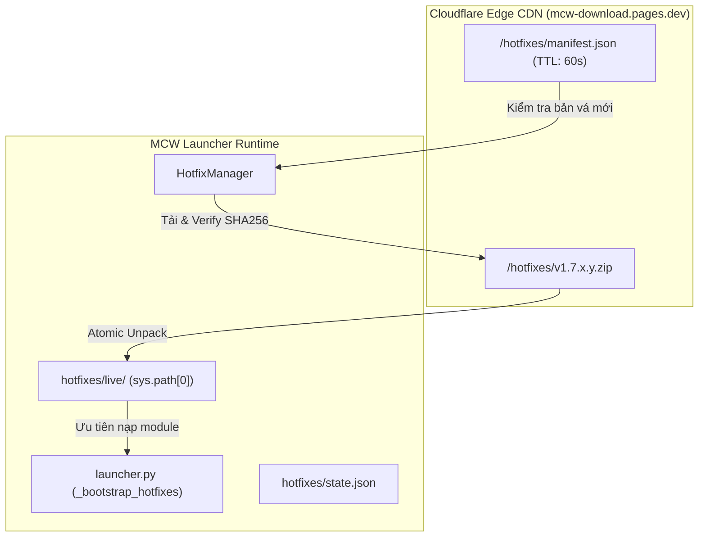

# MCW Launcher - Hệ Thống Hotfix Động (Hotfix Distribution Architecture)

## 1. Tổng Quan & Mục Tiêu

Hệ thống **Hotfix** được thiết kế nhằm phục vụ chu kỳ phát hành từ phiên bản **1.7**, giải quyết bài toán:
- Khắc phục các lỗi nghiêm trọng (crash, API breaker, edge-case bug) tức thì mà **không bắt buộc người dùng phải tải lại toàn bộ bản cài đặt 70MB - 80MB**.
- Phân phối các bản vá runtime Python (chỉ vài chục KB đến vài trăm KB) thông qua mạng lưới **Cloudflare Edge CDN** siêu tốc với các điểm Node Châu Á (Hồng Kông - `HKG` và Singapore - `SIN`).
- Tự động nạp bản vá vào tiến trình launcher mà không làm thay đổi hay làm hỏng cấu trúc cài đặt gốc.

---

## 2. Quy Chuẩn Đặt Tên & Phiên Bản (Versioning Convention)

Định dạng phiên bản được chuẩn hóa theo quy tắc **4 bậc (4-part revision)**:
$$\mathbf{1.7.x.y}$$

Trong đó:
- `1.7`: Nhánh sản phẩm chính (Major.Minor).
- `x`: Bản phát hành chức năng / bảo trì cơ sở (Base Release, ví dụ `1.7.0`, `1.7.1`).
- `y`: Số hiệu bản vá Hotfix (Revision / Patch, ví dụ `1.7.0.1`, `1.7.0.2`).

### Cơ chế so sánh thứ bậc (Evaluation Hierarchy):
```
1.7.0 (gốc) < 1.7.0.1 (hotfix 1) < 1.7.0.2 (hotfix 2) < 1.7.1 (bản nâng cấp cơ sở)
```

Module `src.core.update.versioning.LauncherVersion` hỗ trợ native việc phân tích và so sánh thứ tự này:
- `LauncherVersion.parse("1.7.0.1")` $\rightarrow$ `major=1, minor=7, patch=0, revision=1`.
- Khi launcher nâng cấp lên bản `1.7.1` (`patch=1, revision=0`), thứ tự so sánh luôn đảm bảo `1.7.1 > 1.7.0.2`.

---

## 3. Kiến Trúc Phân Phối (Distribution Topology)



### 3.1. Điểm Truy Cập Mạng (Endpoints):
- **Cổng Manifest**: `https://mcw-download.pages.dev/hotfixes/manifest.json` (Cache TTL: 60 giây).
- **Tệp Nén Vá Lỗi**: `https://mcw-download.pages.dev/hotfixes/{release_tag}.zip`.

### 3.2. Cấu Trúc Manifest (`manifest.json`):
```json
{
  "schema_version": 1,
  "service": "mcw-hotfix-network",
  "updated_at": "2026-09-24T00:00:00Z",
  "active_hotfixes": [
    {
      "base_version": "1.7.0",
      "target_version": "1.7.0.1",
      "hotfix_id": 1,
      "release_tag": "v1.7.0.1",
      "description": "Sửa lỗi crash khi khởi động tài khoản offline",
      "enabled": true,
      "download_url": "https://mcw-download.pages.dev/hotfixes/v1.7.0.1.zip",
      "sha256": "e3b0c44298fc1c149afbf4c8996fb92427ae41e4649b934ca495991b7852b855",
      "size_bytes": 14200,
      "clean_on_upgrade": true,
      "target_modules": [
        "src.core.auth.offline_auth"
      ]
    }
  ]
}
```

---

## 4. Tiêu Chuẩn Bảo Mật & Toàn Vẹn Dữ Liệu (Security & Integrity)

1. **Xác thực mã băm mật mã học (Fail-closed Cryptographic SHA-256)**:
   - Trước khi giải nén bất kỳ tệp vá lỗi nào, `HotfixManager` tính toán SHA-256 của toàn bộ tệp zip tải về.
   - Nếu mã băm không khớp chính xác với `sha256` trong manifest, tệp tải về sẽ bị xóa ngay lập tức và ném lỗi `HotfixVerificationError`. Quá trình cài đặt bị hủy bỏ tuyệt đối.

2. **Chống tấn công leo thang thư mục (Anti-Zip Slip Traversal)**:
   - Tất cả đường dẫn trong tệp nén được kiểm tra nghiêm ngặt trước khi ghi dữ liệu.
   - Nghiêm cấm đường dẫn tuyệt đối hoặc chứa các ký tự duyệt ngược (`..`, `../`, `..\`).
   - Nếu phát hiện tệp tìm cách thoát khỏi thư mục đích, ném `HotfixSecurityError` và hủy bỏ.

3. **Giới hạn hạn mức (Quotas & Zip Bomb Defense)**:
   - Kích thước lưu trữ tối đa cho một gói hotfix: 50 MB.
   - Kích thước giải nén tối đa: 100 MB.
   - Số lượng tệp tối đa: 1,000 tệp.

4. **Tráo đổi nguyên tử (Atomic Directory Swap)**:
   - Toàn bộ gói vá được giải nén vào thư mục tạm `staging_{uuid}`.
   - Chỉ khi quá trình giải nén hoàn tất không có lỗi, thư mục `live` hiện tại mới được hoán đổi sang thư mục mới thông qua thao tác atomic rename.

---

## 5. Cơ Chế Nạp Động & Vòng Đời (Lifecycle & sys.path Injection)

### 5.1. Khởi động ứng dụng (`launcher.py`):
Ngay tại dòng đầu tiên của `main()` trước khi tải Qt hoặc các module lõi:
```python
def main() -> None:
    _bootstrap_hotfixes()
    _start_update_cleanup()
    ...
```
Hàm `_bootstrap_hotfixes()`:
1. Đọc tệp trạng thái `hotfixes/state.json`.
2. Kiểm tra `clean_on_upgrade`: Nếu `state.base_version` khác với `VERSION_ID` hiện tại (ví dụ người dùng vừa cập nhật từ `1.7.0` lên `1.7.1`), toàn bộ thư mục `hotfixes/live` và `state.json` sẽ tự động bị dọn dẹp sạch sẽ.
3. Nếu hotfix hợp lệ cho phiên bản cơ sở hiện tại, thư mục `hotfixes/live` được chèn trực tiếp vào vị trí đầu tiên của `sys.path` (`sys.path.insert(0, ...)`).
4. Các lệnh import kế tiếp của Python sẽ ưu tiên nạp mã nguồn đã vá lỗi trong `hotfixes/live` trước các tệp cũ.

### 5.2. Khôi phục trạng thái gốc (Rollback):
Bất cứ lúc nào người dùng hoặc launcher gặp sự cố, gọi phương thức `HotfixManager.rollback()`:
- Xóa bỏ thư mục `hotfixes/live`.
- Xóa bỏ tệp `hotfixes/state.json`.
- Launcher trở về nguyên trạng ban đầu của gói cài đặt cơ sở.
